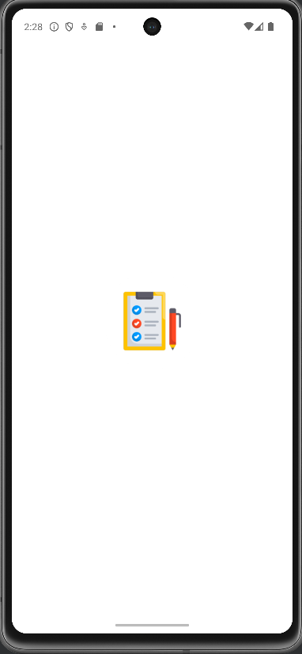
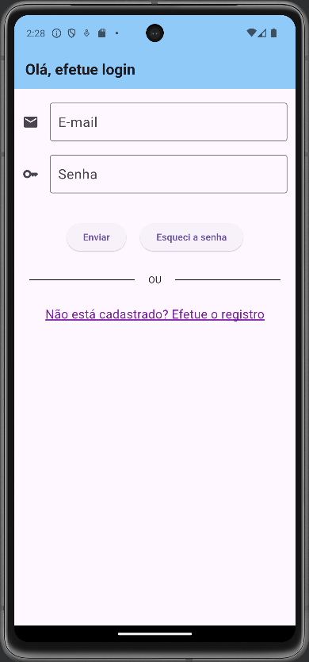

# Aplicativo de celular para listar tarefas a serem executadas

O presente aplicativo tem por objetivo permitir que o usuário acompanhe, por meio do celular, uma lista de tarefas a serem executadas, como ir ao mercado ou limpar a casa. Antes de utilizar o aplicativo, o usuário deve se registrar ou efetuar login. Para cadastrar a tarefa, o usuário informa um título e uma descrição para a mesma. O aplicativo adiciona, automaticamente, a data em que está sendo cadastrada a tarefa e a cidade onde encontra-se o celular. Após cadastrar a tarefa, a mesma pode ser visualizada, alterada ou excluída.

No âmbito técnico, o aplicativo possui as seguintes características:
- foi construído utilizando a linguagem Flutter;
- o registro e login do usuário, bem como a recuperação da senha, são realizados por meio do recurso Authentication do Google Firebase;
- a foto do usuário, tirada no momento do registro, é salva no recurso Storage do Google Firebase;
- o armazenamento das tarefas é realizado no próprio celular, por meio da biblioteca "sqflite";
- a localização do celular é realizada por meio da biblioteca "location" e a identificação da cidade usando a latitude e longitude do celular é feita por meio de API gratuita voltada pela essa finalidade;
- o gerenciamento do estado da relação de tarefas cadastradas é realizado pela biblioteca "provider";
- as caixas para o usuário inserir e-mail e senha durante o login, registro e recuperação de senha são provenientes de um pacote salvo no GitHub e carregado pelo aplicativo;
- o aplicativo possui testes unitários para as funções que adicionam novas tarefas e para as funções que recuperam, criam ou alteram registros no banco de dados;
- o aplicativo possui teste de integração para a tela de login; e
- foi gerado o arquivo "app-release.aab", que encontra-se na pasta raiz do projeto, para publicação na Play Store.
  

As imagens a seguir mostram a aplicação em funcionamento:

1. Image da tela de abertura do aplicativo

2. Image da tela de login

3. Image da tela de registro

4. Image da tela de recuperação da senha

5. Image da tela principal, contendo a lista de tarefas

6. Imagem da tela de adicionar tarefa

7. Imagem da tela de atualizar tarefa

